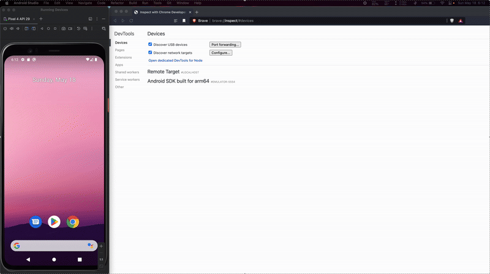

# flutter_stetho_interceptor

**flutter_stetho_interceptor** is a Flutter plugin to inspect HTTP API requests and responses in **Chrome DevTools** using [Facebook's Stetho](https://github.com/facebook/stetho).  
It enables powerful debugging of network calls, similar to Chrome's Network tab, for your Flutter Android applications.

> ⚠️ **Note**: This plugin supports **only Android** and is based on the now-discontinued `flutter_stetho` package.

---

## ✨ Features

- Intercepts and logs all HTTP requests made via Dart's `HttpClient`
- Displays network traffic (requests, responses, headers, body, etc.) in Chrome DevTools
- Supports streaming of request/response bodies

---
## 👨‍💻Demo

---

## 🔧 Installation

Add this to your `pubspec.yaml` file:

```yaml
dependencies:
  flutter_stetho_interceptor: ^0.0.1
```

🚀 Getting Started
# flutter_stetho_interceptor

[](https://github.com/rathorerahul586/flutter_stetho_interceptor/actions)


**flutter_stetho_interceptor** is a Flutter plugin to inspect HTTP API requests and responses in **Chrome DevTools** using [Facebook's Stetho](https://github.com/facebook/stetho).  
It enables powerful debugging of network calls, similar to Chrome's Network tab, for your Flutter Android applications.

> ⚠️ **Note**: This plugin supports **only Android** and is based on the now-discontinued `flutter_stetho` package.

---

## ✨ Features

- Intercepts and logs all HTTP requests made via Dart's `HttpClient`
- Displays network traffic (requests, responses, headers, body, etc.) in Chrome DevTools
- Supports streaming of request/response bodies
- Inspired by and modernized from the deprecated `flutter_stetho` plugin

---

## 🔧 Installation

Add this to your `pubspec.yaml` file:

```yaml
dependencies:
  flutter_stetho_interceptor: ^0.0.1
```
---

## 🚀 Getting Started
- **Initialize StethoFlutter:** In your main.dart, call the `FlutterStethoInterceptor.initialize();` before any HTTP requests:

 ```
 import 'package:flutter/material.dart';
import 'package:http/http.dart' as http;
import 'package:flutter_stetho_interceptor/flutter_stetho_interceptor.dart';

void main() {
  StethoFlutter.initialize(); // <-- Initialize plugin

  runApp(MyApp(client: http.Client()));
}
```
- **Make Requests:** Make requests using http.Client or HttpClient

---
## 🧭 Viewing in Chrome DevTools

- Ensure your Android emulator/device is connected and debugging enabled.
- Open Chrome and visit: `chrome://inspect`
- Click **inspect** under your app to view real-time network traffic in the **Network tab**.
---

# ⁉️Troubleshooting 🛠
**DevTools Window Not Showing or Rendering Incorrectly**

If you notice that the Chrome DevTools window does not appear or renders incorrectly when inspecting your Flutter app using Stetho

This issue appears to stem from a change introduced in Chrome/Chromium versions after **88.0.4324**, which affects how the DevTools window renders when using Stetho.

As discussed in this [GitHub comment](https://github.com/facebook/stetho/issues/696#issuecomment-2888207625), a practical workaround is to use an older version of a Chromium-based browser.

## ✅ Recommended workaround:

Use [`Brave v1.20.110`](https://github.com/brave/brave-browser/releases/tag/v1.20.110), which is based on *Chromium 88.0.4324*. This version properly renders the DevTools window when inspecting via Stetho.

## 📱 Platform Support

| Platform | Supported |
| -------- | --------- |
| Android  | ✅ Yes     |
| iOS      | ❌ No      |
| Web      | ❌ No      |
| Desktop  | ❌ No      |


## 📦 Based On
- [Facebook's Stetho](https://github.com/facebook/stetho).
- [flutter_stetho (deprecated)](https://pub.dev/packages/flutter_stetho).

## 🙏 Credits
Developed and maintained by [@rathorerahul586](https://github.com/rathorerahul586)
Inspired by the original **flutter_stetho** plugin and adapted for modern Flutter versions with enhancements.

## 📄 License
This project is licensed under the MIT License.

